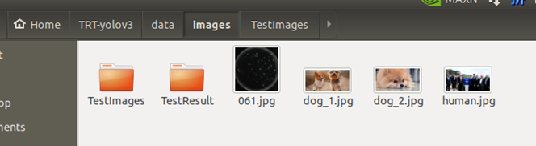
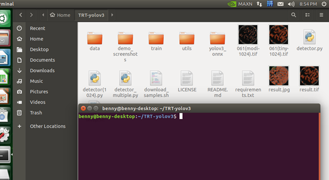
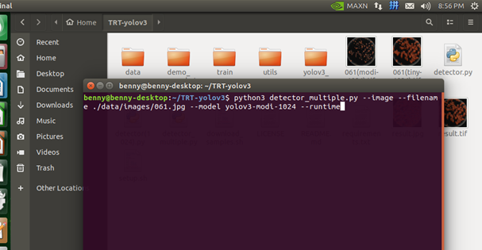
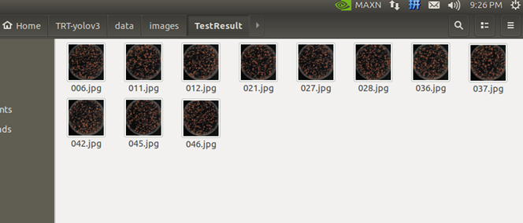
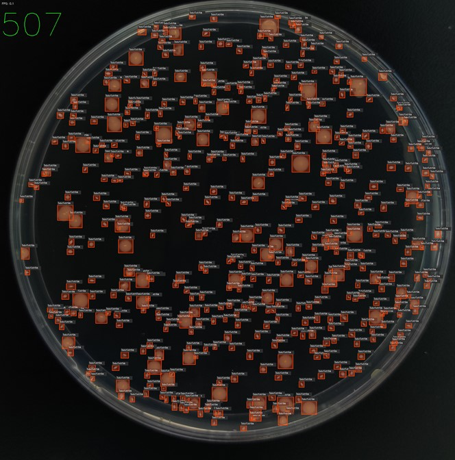
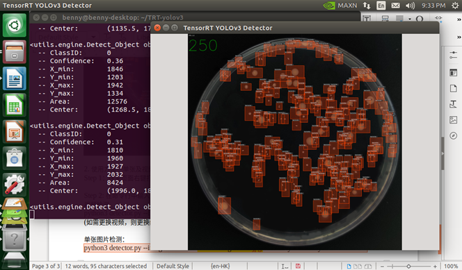
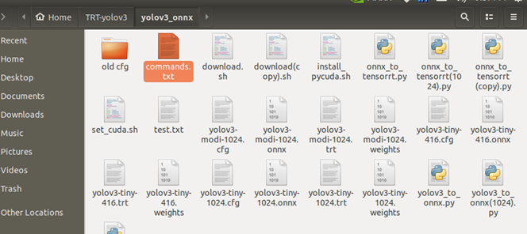

菌落检测边缘设备jetson nano使用手册
===

<!-- @import "[TOC]" {cmd="toc" depthFrom=1 depthTo=6 orderedList=false} -->

<!-- code_chunk_output -->

- [1. 使用方法--批量测试](#-1-使用方法-批量测试-)
- [2. 使用方法—单张及视频测试](#-2-使用方法单张及视频测试-)

<!-- /code_chunk_output -->

# 1. 使用方法--批量测试
Step 1: 将需要测试的图片，放入/home/benny/TRT-yolov3/data/images/TestImages 文件夹。

Step 2: 回到TRT-yolov3主目录，右键鼠标选择 open terminal

Step 3: 在命令行中输入命令
> python3 detector_multiple.py --image --filename ./data/images/061.jpg --model yolov3-modi-1024 –runtime

特别说明：
1. yolov3-modi-1024 中的modi可以换为 tiny，tiny模型的运算速度更快，但准确率稍差。
2. 由于detector_multiple.py是专门编写的用来批量测试文件，测试命令的读取路径固定为/home/benny/TRT-yolov3/data/images/TestImages 文件夹，所以--filename中的./data/images/061.jpg 路径仅用于占位，使得原命令调用完整，并不会影响实际的读取文件。
3. 如果想更改文件的默认读取和保存路径，则需要更改detector_multiple.py文件中的:
* (读取图片路径)	folder_address = "/home/benny/TRT-yolov3/data/images/TestImages/"
* （保存图片路径）cv2.imwrite("/home/benny/TRT-yolov3/data/images/TestResult/"+image_in_folder, img)

Step 4: 在/home/benny/TRT-yolov3/data/images/TestResult文件夹中查看检测结果

# 2. 使用方法—单张及视频测试
Step 1：在主页面右键打开open terminal

Step 2: 在命令行中输入命令
视频检测
python3 detector.py --file --filename ./data/videos/test.mp4 --model yolov3-modi-1024 --runtime
(如需更换视频，则更换红色字体为对应名称)

单张图片检测：
python3 detector.py --image --filename ./data/images/061.jpg --model yolov3-tiny-1024 --runtime

全command使用范例如：/home/benny/TRT-yolov3/yolov3_onnx/commands.txt所示

